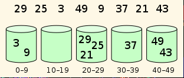

# Bucket Sort

- [Bucket Sort](#bucket-sort)
  - [简介](#简介)
  - [算法](#算法)
  - [参考](#参考)

2021-05-28, 09:26
@Jiawei Mao
***

## 简介

桶排序（Bucket sort），也称为箱排序，是一种对比排序算法。

当输入均匀分布在指定范围，桶排序很有用。例如：在 0.0 到 1.0 内均匀分布大量的浮点数。

最简单的是使用基于对比的排序算法，如 Merge Sort, Heap Sort, Quick-Sort 等，这些算法的时间复杂度为 $Ω(n Log n)$，即它们的性能不超过 nLogn。

能否以线性时间排序？此处不能用计数排序（counting sort），因为计数排序需要将 key 作为 index 使用，此处键值为 float 类型。

此处使用 bucket sort 正合适。
Bucket sort, 也称为 bin sort, 将数组元素放到一系列 buckets中，然后对每个 buckets 分别排序（可以使用任意算法排序，如简单的插入排序）。Bucket sort 可以使用对比实现，所以也可以认为是一种对比排序算法。

桶排序的时间复杂度取决于对每个 bucket 使用的排序算法、使用的 buckets 的数目、以及输入是否均匀分布。
时间复杂度最坏情况：$O(n^2)$

平均性能：$O(n+\frac{n^2}{k}+k)$, k 是 buckets 数目

空间复杂度最坏情况： $O(n*k)$

## 算法

```c
function bucketSort(array, k):
    buckets <- new array of k empty lists
    M <- the maximum key value in the array
    for i = 1 to length(array):
        insert array[i] into buckets[floor(array[i]/M * k)]
    for i = 1 to k:
        nextSort(buckets[i])
    return the concatenation fo buckets[1], …, buckets[k]
```

Elements are distrbuted among bins



Then, elements are sorted within each bin


## 参考

- <https://en.wikipedia.org/wiki/Bucket_sort>
- <https://www.geeksforgeeks.org/bucket-sort-2/>
- https://www.tutorialspoint.com/data_structures_algorithms/bubble_sort_algorithm.htm
